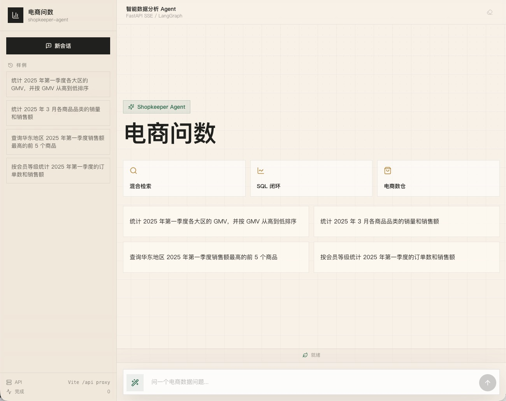
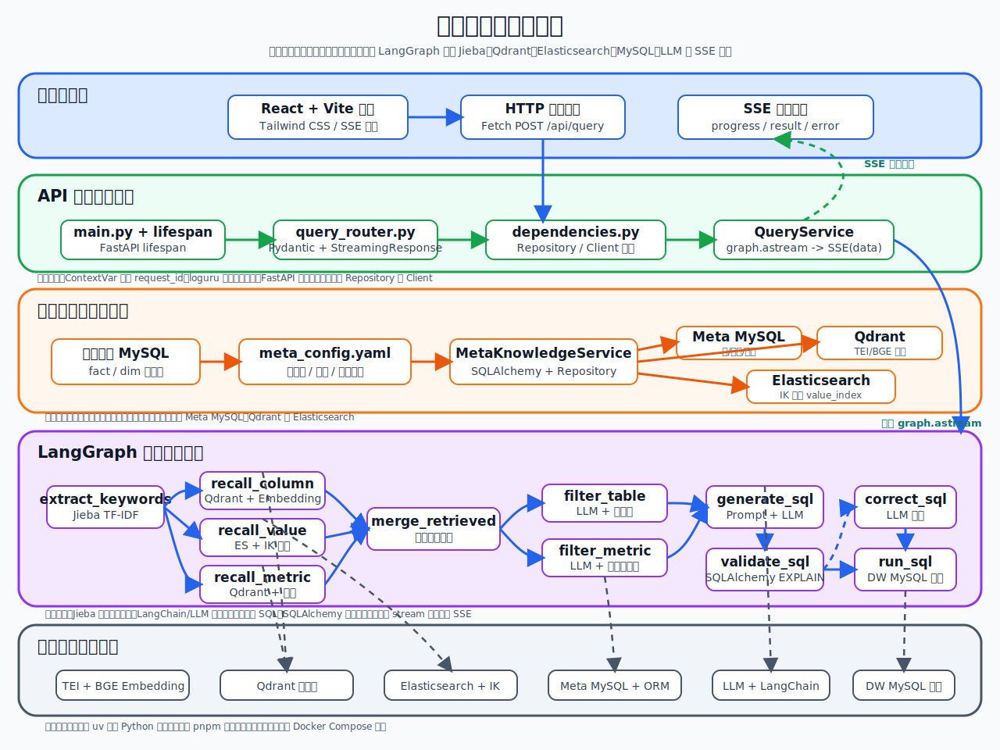
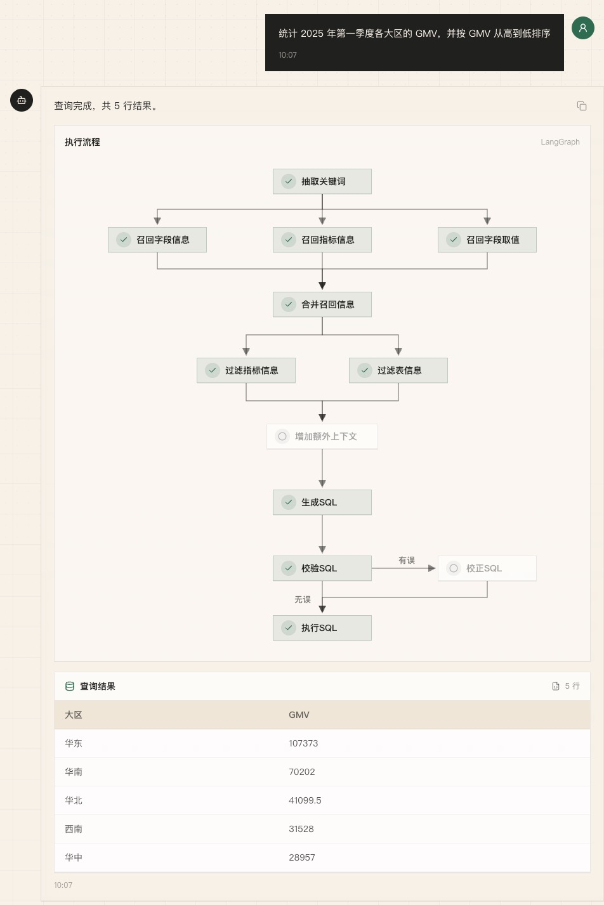

# shopkeeper-agent

电商问数智能数据分析 Agent。

这是一个面向电商数据仓库场景的自然语言问数系统。用户不需要写 SQL，只要用中文提出业务问题，系统就会自动理解问题、召回相关元数据、生成 SQL、校验 SQL、执行查询，并把结果以聊天式界面、表格、图表和分析卡片的形式返回。

它不是一个简单的 Text-to-SQL Demo，而是一条完整的企业级问数链路实践：从元数据知识库构建、混合检索、LangGraph Agent 编排，到 SQL 安全防护、多轮上下文、历史会话、结果产品化、前后端联调和测评体系。



## 项目定位

在真实的数据分析场景中，业务同学通常不会写 SQL，数据分析同学也很难随时记住所有表结构、字段含义、指标口径和字段取值。单纯把自然语言问题直接交给大模型，很容易出现表选错、字段选错、指标理解错、枚举值写错、SQL 幻觉等问题。

`shopkeeper-agent` 要解决的就是这个问题。

系统会先围绕用户问题召回字段、指标和字段取值，再把可靠的业务上下文交给 LangGraph 编排的 Agent 流程，完成意图判断、业务澄清、SQL 生成、SQL 校验、SQL 修正、SQL 执行和结果展示。

一句话概括：

> 用自然语言驱动电商数据查询，用 RAG 增强 SQL 生成，用 LangGraph 管理复杂流程，并把查询结果产品化展示给用户。

## 当前能力

### 1. 自然语言问数

用户可以直接输入中文业务问题，例如：

```text
统计 2025 年第一季度各大区的 GMV，并按 GMV 从高到低排序
统计 2025 年 3 月各商品品类的销量和销售额
查询华东地区 2025 年第一季度销售额最高的前 5 个商品
按会员等级统计 2025 年第一季度的订单数和销售额
```

系统会自动生成 SQL、执行查询，并返回分析结果。

### 2. 元数据知识库

项目会把电商数仓中的表、字段、指标、字段取值整理成可检索的元数据知识库。

- `MySQL`：保存结构化元数据，包括表、字段、指标、字段指标关系等。
- `Qdrant`：保存字段和指标向量，用于语义召回。
- `Elasticsearch`：保存字段真实取值，用于关键词和枚举值检索。
- `Embedding`：将问题、字段、指标等文本转换成向量。

这让模型生成 SQL 前可以先拿到可靠上下文，而不是盲猜表名和字段名。

### 3. 三路混合召回

系统围绕用户问题进行三类召回：

- 字段召回：找到相关表字段。
- 指标召回：找到业务指标定义，例如 GMV、销售额、订单数。
- 字段取值召回：找到地区、品类、会员等级等真实枚举值。

召回结果会经过合并、过滤、补全，再进入 SQL 生成节点。

### 4. LangGraph Agent 编排

后端使用 `LangGraph` 把问数链路拆成多个可观察、可测试、可扩展的节点。

```text
意图检查
业务口径澄清
关键词抽取
字段召回
指标召回
字段取值召回
召回结果合并
表过滤
指标过滤
上下文补全
SQL 生成
SQL 校验
SQL 修正
SQL 执行
结果返回
```



### 5. SQL 安全防护和修正闭环

系统不会直接执行模型生成的 SQL，而是先进行校验。

校验内容包括：

- 是否为只读查询。
- 是否包含危险 SQL。
- 是否存在语法或执行风险。
- 是否需要自动修正。

如果 SQL 校验失败，流程会进入自动修正节点，并重新校验。重试次数有上限，避免模型无限修正。

### 6. 数据变更审批 Agent

项目支持识别数据变更类意图，例如删除、修改、写入数据。

这类请求不会被直接执行，而是进入审批计划链路：

```text
识别变更意图
生成操作方案
预估影响范围
返回审批计划
```

系统默认保护数据库安全，只返回变更方案、风险等级、影响行数和预览 SQL，不直接执行写操作。

### 7. 业务口径澄清

当用户问题存在歧义时，系统会主动追问。

例如用户只说“统计销售额”，但销售额可能存在多个业务口径，系统会要求用户进一步确认，而不是直接猜一个 SQL。

这让问数过程更接近真实数据分析协作。

### 8. 多轮上下文和历史会话

项目支持多轮问答和历史会话。

例如用户先问：

```text
统计华东地区 3 月销售额
```

然后继续问：

```text
那华北呢？
```

系统会结合历史上下文，把后续问题改写成完整问题再进入 Agent 流程。

当前支持：

- 查询历史会话列表。
- 查看指定会话历史。
- 删除历史会话。
- 保存原始问题、改写后问题、SQL、结果摘要、错误信息、上下文轨迹等。

### 9. 查询结果产品化

项目不只返回原始表格，还会对查询结果做产品化处理。

当前支持：

- 查询结果摘要。
- 关键事实提取。
- 结果分析。
- 分析卡片展示。
- 图表展示。
- CSV 导出。
- 历史结果回看。



### 10. 前端聊天式交互

前端使用 `React + Vite + TypeScript + Tailwind CSS` 构建。

支持：

- 聊天式自然语言问数。
- SSE 流式展示 Agent 执行进度。
- 查询结果表格。
- 查询结果图表。
- 结果分析卡片。
- 数据变更审批方案展示。
- 上下文改写轨迹展示。
- 历史会话查看和删除。
- 停止当前查询。

## 技术架构

```text
前端层
React / Vite / TypeScript / Tailwind CSS / SSE

接口层
FastAPI / StreamingResponse / Dependency Injection

服务层
QueryService / QueryHistoryService / MetaKnowledgeService

Agent 编排层
LangGraph / DataAgentState / DataAgentContext / Agent Nodes

检索层
Qdrant / Elasticsearch / Embedding

数据层
MySQL 元数据库 / MySQL 电商数仓

安全与增强层
SQL Guard / Query Intent Guard / Operation Intent Guard
Clarification Guard / Context Rewrite / Result Productization

测评层
RAG Eval / Query Eval / Trace / Metrics / Reports
```

## 技术栈

| 模块 | 技术 | 作用 |
| --- | --- | --- |
| 后端接口 | FastAPI | 提供问数 API、历史会话 API 和依赖注入 |
| Agent 编排 | LangGraph | 组织多节点问数工作流 |
| 模型接入 | LangChain | 封装 LLM 和 Embedding 调用 |
| 元数据库 | MySQL / SQLAlchemy | 保存表、字段、指标和历史会话 |
| 数仓库 | MySQL | 模拟电商数据仓库查询环境 |
| 向量检索 | Qdrant | 字段和指标语义召回 |
| 全文检索 | Elasticsearch | 字段真实取值检索 |
| Embedding | TEI / BAAI/bge-large-zh-v1.5 | 文本向量化 |
| 前端 | React / Vite / Tailwind CSS | 聊天式问数界面和结果展示 |
| 流式协议 | SSE | 实时返回 Agent 节点进度和结果 |
| 测评 | pytest / eval runners | 召回、路由、SQL、安全和结果分析测评 |

## 项目结构

```text
shopkeeper-agent/
├── app/
│   ├── agent/                     # LangGraph 图、状态、上下文和节点
│   ├── api/                       # FastAPI 路由、依赖注入、请求结构
│   ├── clients/                   # MySQL、Qdrant、ES、Embedding 客户端管理
│   ├── conf/                      # 配置加载
│   ├── core/                      # SQL 防护、意图识别、上下文改写、结果产品化
│   ├── entities/                  # 业务实体
│   ├── models/                    # SQLAlchemy ORM 模型
│   ├── prompt/                    # Prompt 加载工具
│   ├── repositories/              # MySQL、Qdrant、Elasticsearch 数据访问层
│   ├── scripts/                   # 元数据知识库构建脚本
│   └── services/                  # 查询服务、历史服务、元数据服务
├── conf/                          # app_config.yaml、meta_config.yaml
├── docker/                        # Docker Compose、MySQL 初始化、ES 插件
├── docs/                          # 项目方案文档和配图
├── eval/                          # 测评数据、指标、runner 和报告
├── frontend/                      # React 前端项目
├── prompts/                       # SQL 生成、修正、过滤等 Prompt 模板
├── tests/                         # 单元测试和链路测试
├── main.py                        # FastAPI 应用入口
└── pyproject.toml                 # Python 依赖和工具配置
```

## 后端核心流程

核心图编排位于 `app/agent/graph.py`。

一次普通问数请求大致会经过：

1. `check_query_intent`：判断是否为危险意图或数据变更意图。
2. `check_clarification`：判断业务口径是否需要澄清。
3. `extract_keywords`：抽取用户问题关键词。
4. `recall_column`：召回相关字段。
5. `recall_metric`：召回相关指标。
6. `recall_value`：召回字段真实取值。
7. `merge_retrieved_info`：合并三路召回结果。
8. `filter_table`：筛选候选表。
9. `filter_metric`：筛选候选指标。
10. `check_recall_result`：判断上下文是否足够继续生成 SQL。
11. `add_extra_context`：补充日期、数据库方言、表结构等上下文。
12. `generate_sql`：生成 SQL。
13. `validate_sql`：校验 SQL。
14. `correct_sql`：必要时修正 SQL。
15. `run_sql`：执行 SQL 并返回结果。

如果用户输入的是变更类请求，则会进入：

```text
generate_operation_plan
estimate_operation_impact
return_operation_plan
```

如果问题需要进一步确认，则会进入：

```text
ask_clarification
```

如果召回结果不足，则会进入：

```text
unable_to_answer
```

## API 接口

### 提交问数请求

```http
POST /api/query
```

请求示例：

```json
{
  "query": "统计 2025 年第一季度各大区的 GMV",
  "session_id": "optional-session-id"
}
```

响应为 SSE 流，事件类型包括：

- `session`：返回当前会话 ID。
- `context_trace`：返回上下文改写轨迹。
- `progress`：返回 Agent 节点执行进度。
- `clarification`：返回澄清问题。
- `operation_plan`：返回数据变更审批方案。
- `result`：返回查询结果。
- `result_analysis`：返回结果分析。
- `error`：返回错误信息。

### 查询历史会话

```http
GET /api/sessions
```

### 查询指定会话历史

```http
GET /api/sessions/{session_id}/history
```

### 删除指定会话

```http
DELETE /api/sessions/{session_id}
```

## 快速开始

### 1. 准备环境

需要安装：

- Python `>= 3.14`
- `uv`
- Docker 和 Docker Compose
- Node.js
- `pnpm`

### 2. 安装后端依赖

```bash
uv sync
```

### 3. 配置模型 API Key

复制环境变量文件：

```bash
cp .env.example .env
```

然后在 `.env` 中填写：

```env
LLM_API_KEY=your_real_api_key
```

默认模型配置位于 `conf/app_config.yaml`。

### 4. 准备 Embedding 模型

项目默认使用 `BAAI/bge-large-zh-v1.5`。

```bash
uv run hf download BAAI/bge-large-zh-v1.5 --local-dir docker/embedding/bge-large-zh-v1.5
```

也可以手动下载并放到：

```text
docker/embedding/bge-large-zh-v1.5
```

### 5. 启动基础服务

```bash
docker compose -f docker/docker-compose.yaml up -d
```

默认端口：

| 服务 | 端口 |
| --- | --- |
| MySQL | 3306 |
| Elasticsearch | 9200 |
| Kibana | 5601 |
| Qdrant | 6333 |
| Embedding | 8081 |

`docker/mysql/meta.sql` 和 `docker/mysql/dw.sql` 会在 MySQL 容器首次启动时初始化元数据库和电商数仓。

### 6. 构建元数据知识库

```bash
uv run python -m app.scripts.build_meta_knowledge -c conf/meta_config.yaml
```

这一步会：

- 将表、字段、指标等结构化元数据写入 MySQL。
- 将字段和指标向量写入 Qdrant。
- 将字段真实取值写入 Elasticsearch。

### 7. 启动后端

```bash
uv run fastapi dev main.py
```

后端默认地址：

```text
http://127.0.0.1:8000
```

### 8. 启动前端

```bash
cd frontend
pnpm install
pnpm dev
```

前端默认地址：

```text
http://127.0.0.1:5173
```

## 测试和测评

运行后端测试：

```bash
uv run pytest
```

运行前端类型检查和构建：

```bash
cd frontend
pnpm lint
pnpm build
```

项目包含面向不同能力的测试：

- SQL 安全防护。
- 查询意图识别。
- 数据变更意图识别。
- 业务口径澄清。
- 多轮上下文改写。
- RAG 召回结果检查。
- Agent 路由逻辑。
- 查询历史。
- 结果产品化。
- 测评报告生成。

`eval/` 目录提供了 RAG 和问数链路测评相关的数据集、指标、runner 和报告工具。

## 项目亮点

- 不是单点 Prompt Demo，而是一套完整的问数工程链路。
- 使用字段、指标、取值三路混合召回增强 SQL 生成上下文。
- 使用 LangGraph 编排复杂 Agent 流程，节点清晰、流程可观察。
- SQL 生成后先校验，失败后修正，形成安全闭环。
- 对删除、修改、写入等数据变更请求默认不执行，只生成审批方案。
- 支持业务口径澄清，减少指标理解错误。
- 支持多轮上下文改写和历史会话。
- 支持查询结果摘要、事实提取、分析卡片、图表和 CSV 导出。
- 提供前后端完整实现和测评体系，适合作为企业级 AI Agent 项目实践。

## 简历描述参考

```text
基于 FastAPI、LangGraph、Qdrant、Elasticsearch、MySQL 和 React 构建电商自然语言问数 Agent。系统通过字段、指标、取值三路混合召回增强 SQL 生成上下文，使用 LangGraph 编排意图识别、业务澄清、SQL 生成、校验、修正和执行流程，并通过 SSE 向前端实时返回执行进度和查询结果。同时支持多轮上下文改写、历史会话、数据变更审批方案、结果分析和可视化展示，形成了一套完整的企业级智能问数应用链路。
```

## 适合学习的内容

这个项目适合用于系统学习：

- 如何构建企业级自然语言问数系统。
- 如何把 RAG 和 Text-to-SQL 结合起来。
- 如何用 LangGraph 编排复杂 Agent 工作流。
- 如何做 SQL 安全防护和修正闭环。
- 如何处理业务口径澄清和多轮上下文。
- 如何把查询结果从原始表格升级成可用的数据产品体验。

## License

This project is licensed under the MIT License.
